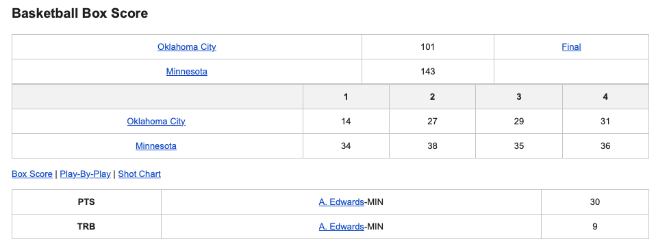

# Basketball Results Email Sender

This is a C# application that scrapes basketball game results and sends them via email. It leverages the [HtmlAgilityPack](https://github.com/zzzprojects/html-agility-pack) library for HTML parsing and uses Gmail's SMTP service to send emails.

## Features

- Scrapes the latest basketball game results from a specified source.
- Sends the results via email using Gmail SMTP.
- Customizable SMTP settings via `appsettings.json`.

## Mail Example


## Prerequisites

- [.NET SDK](https://dotnet.microsoft.com/download) installed on your system.
- A [Gmail account](https://mail.google.com/).
- [HtmlAgilityPack](https://www.nuget.org/packages/HtmlAgilityPack/) NuGet package (restored automatically).

## Getting Started

### 1. Clone the Repository

```bash
git clone https://github.com/KamilKolanowski/CodeReviews.Console.SportsResults.git
cd SportsResults.KamilKolanowski
```

### 2. Configure Gmail SMTP

To send emails from your Gmail account, you need to create an **App Password**:

1. Go to your [Google Account Security settings](https://myaccount.google.com/security).
2. Enable **2-Step Verification** if it's not already enabled.
3. Under "Signing in to Google," select **App Passwords**.
4. Generate an app password for "Mail" and your device.
5. Copy the generated password.

### 3. Update `appsettings.json`

Create or update the `appsettings.json` file in your project root with your SMTP configuration:

```json
{
  "Smtp": {
    "Host": "smtp.gmail.com",
    "Port": 587,
    "UseSsl": false,
    "Username": "<your_gmail_address@gmail.com>",
    "Password": "<your_app_password>"
  }
}
```

- Replace `<your_gmail_address@gmail.com>` with your Gmail address.
- Replace `<your_app_password>` with the app password you generated.

### 4. Restore Dependencies

Before running the application, restore NuGet packages:

```bash
dotnet restore
```

### 5. Run the Application

```bash
dotnet run
```

The app will scrape basketball results and send them via email using your Gmail account.

## Usage Notes

- Ensure less secure app access is **disabled** and you are using an app password, not your Gmail account password.
- The HTML scraping logic can be modified to target your preferred basketball results source.
- Customize recipient details and email content as needed in the source code.

## Dependencies

- [HtmlAgilityPack](https://www.nuget.org/packages/HtmlAgilityPack/)
- [MailKit](https://www.nuget.org/packages/MailKit/)
- .NET 6 or higher
  
## Contributing

Contributions are welcome! Please open an issue or submit a pull request.

---

**Disclaimer:** This project is for educational purposes. Please respect the terms of service of any websites you scrape.